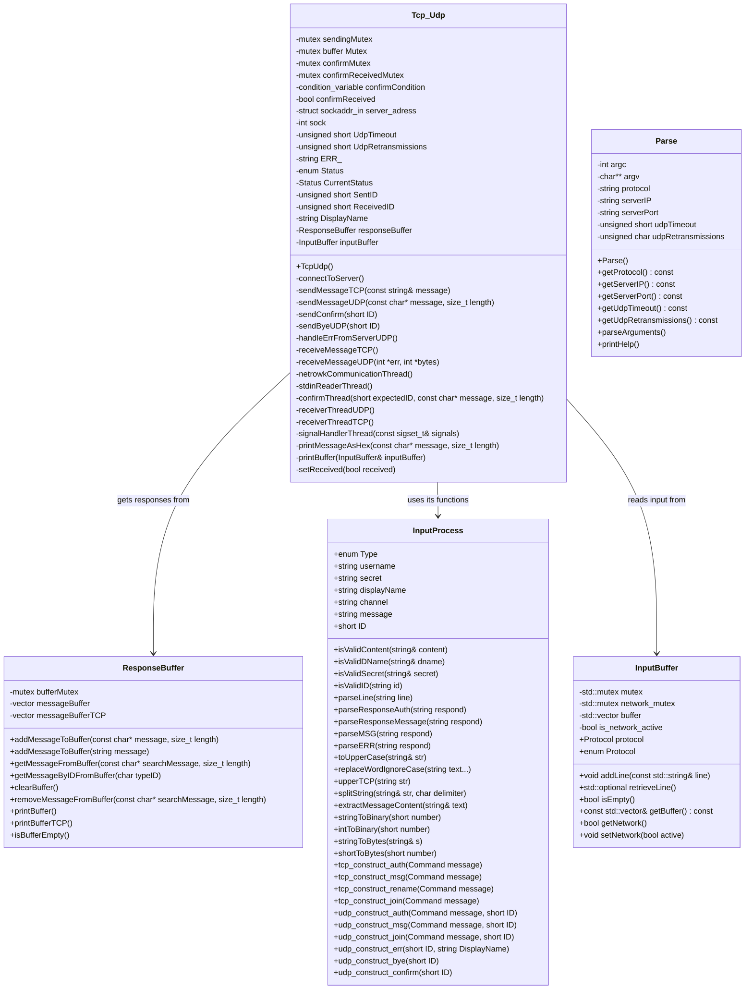

# IPK24CHAT-CLIENT

## Table of Contents

- [IPK24CHAT-CLIENT](#ipk24chat-client)
  - [Table of Contents](#table-of-contents)
  - [Introduction](#introduction)
  - [Getting Started](#getting-started)
    - [Prerequisites](#prerequisites)
    - [Installation](#installation)
  - [Testing](#testing)
  - [License](#license)
  - [Acknowledgements](#acknowledgements)

## Introduction

This is a simple client for messaging service. It uses both UDP and TCP protocols to send and receive messages. The client is written in C++ and uses the `unix socket` framework to communicate with the server.

## Getting Started

These instructions will get you a copy of the project up and running on your local machine for development and testing purposes.


### Prerequisites

C++ compiler and `make` utility are required to build the project. The project is tested on `g++` compiler.

The client itself desired to run on **Linux OS**. The project was tested on **Ubuntu**.

### Installation

1. Clone the repo
   ```sh
   git clone https://git.fit.vutbr.cz/xkhoda01/IPK_1st_project.git
    ```
2. Build the project
    ```sh
    make
    ```
3. Run the client
    ```sh
    ./ipk24-chat-client.exe -t <protocol> -s <server_ip> -p <server_port> 
    ```

## Usage

The client can be used to send and receive messages from the server. The client supports the following commands:

- `/auth Username DisplayName Secret` - Authenticate the user with the server. `Username` is your login, `DisplayName` will be your Nickname, `Secret` is token for authentication.

- `<Message>` - Send a message to the user with the username `Username`.

- `/rename` - Change your `DisplayName`.

- `/join discord.Channel` - join the `Channel`.

- `/help` - Display the help message.

- `CTRL/COMMAND + C` or `CTRL/COMMAND + D` - Exit the client.

## Architecture

The client is written in C++ and uses the `unix socket` framework to communicate with the server. The client uses both UDP and TCP protocols to send and receive messages. The client is designed to be simple and easy to use. The project is OOP based and uses classes to encapsulate the functionality of the client.

Below you can see the class diagram of the client:


## Testing

The project was tested by hand on reference server. Also it was tested using `netcat` for TCP protocol and `tcpdump` for UDP protocol.

*Some additional testing scripts were used provided by colleges to test the project and its edge cases.*

```
❌ 47/51 test cases passed
```
47/51 tests passed. In tests were tested such things as client state possibilities, server responses, message sending, message receiving, race conditions, allowed characters for DisplayName, Secret, Username, and Channel, etc.

The script itself runs on python3 and simulates the user behavior. So the example inputs were the same as user could provide. For example:
```
======================== ⏳ Starting test 'tcp_auth_ok' ========================
STDERR: Success: vsechno cajk
✅ Test 'tcp_auth_ok': PASSED
Test 'tcp_auth_ok' finished

Stdin: /auth a b c
```

The 4 remaining tests were failed due to unknown reasons, so they weren't fixed.

In some cases `gdb` debugging was used to find the problem in the code or the *print debugging*.

## License

This project is licensed under the GNU Affero General Public License Version 3 (AGPLv3). This license is similar to the GPL but includes an additional provision that requires you to provide source code to network users, ensuring that all users of the software, even when it's run on servers over a network, have access to its source code and the freedom to modify and share it. This makes AGPLv3 one of the most user- and freedom-protecting licenses available for open-source software.

For more details, see the [GNU official page](https://www.gnu.org/licenses/agpl-3.0.en.html) on AGPLv3.

## Acknowledgements

- **Chat GPT 4** - for helping with the project problem studying and debugging help.
- **Vitek Kvitek** - for the stream that helped with general project understanding. (repository: [IPK-Proj01-Livestream](https://github.com/okurka12/ipk_proj1_livestream))
- **Tomáš Hobza** - Unit tests for the project. (repository: [IPK-01-Tester](https://git.fit.vutbr.cz/xhobza03/ipk-client-test-server)) 
*However i used extended variant of the tester. Unfortunately i dont have link to it since I found it somewhere over discord*


